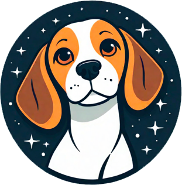

# maniac

    

Enhance Vue.js projects effortlessly with maniac: a curated collection of components, CLI-powered simplicity, seamless integration, style autonomy and total ownership.
Accessibility-ready, fully customizable and open source. 🤘

Perfectly fit with Vue.js & create-vue 🥰❤️‍🔥
